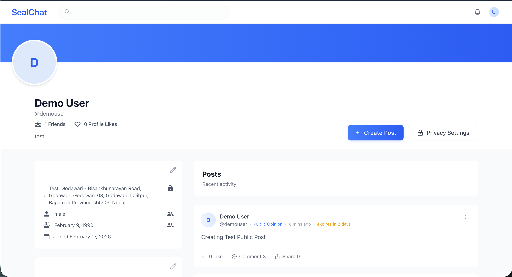
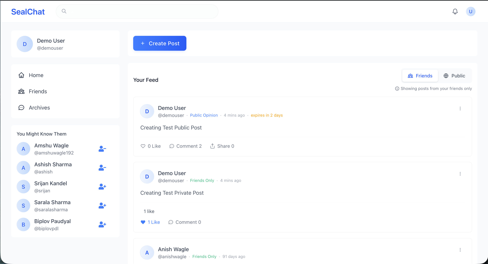
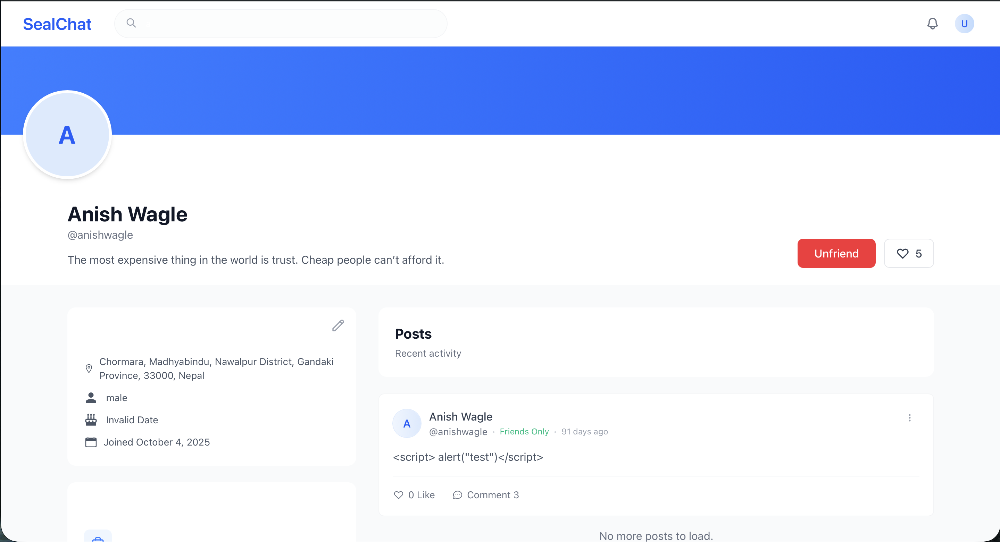
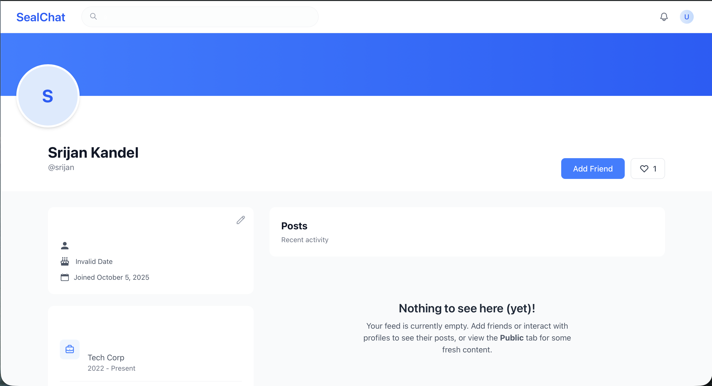
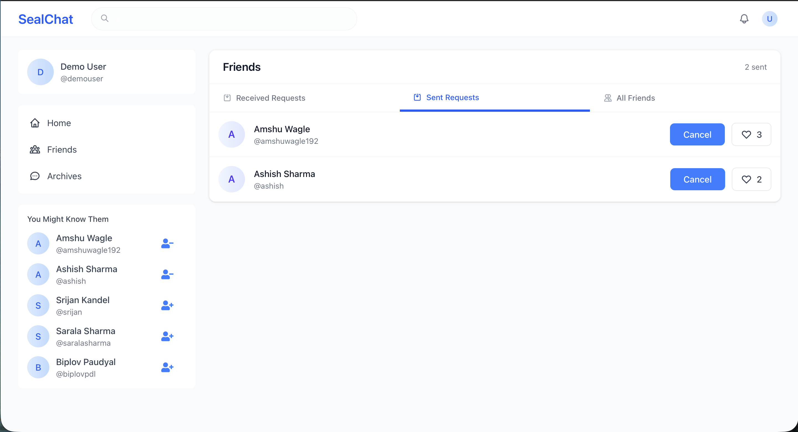
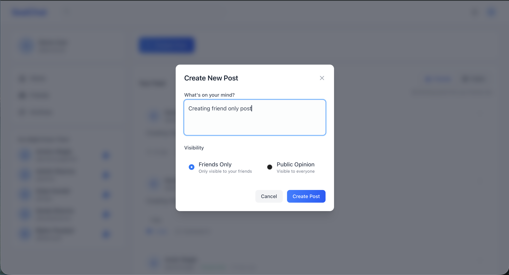
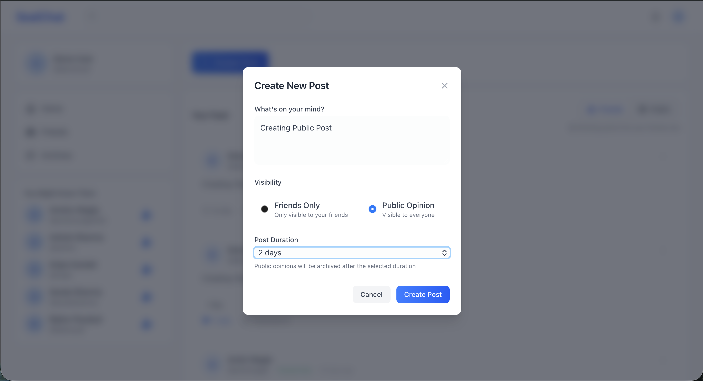
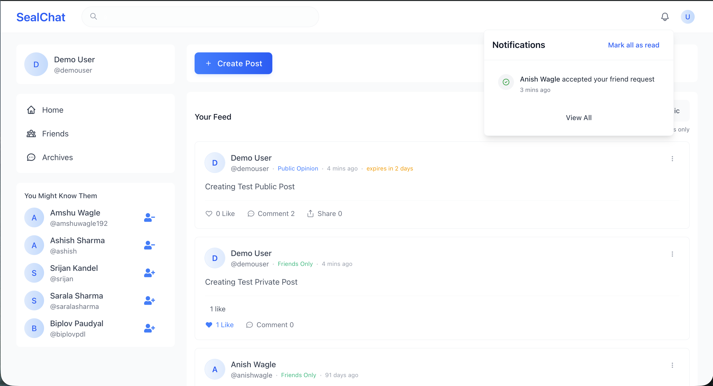
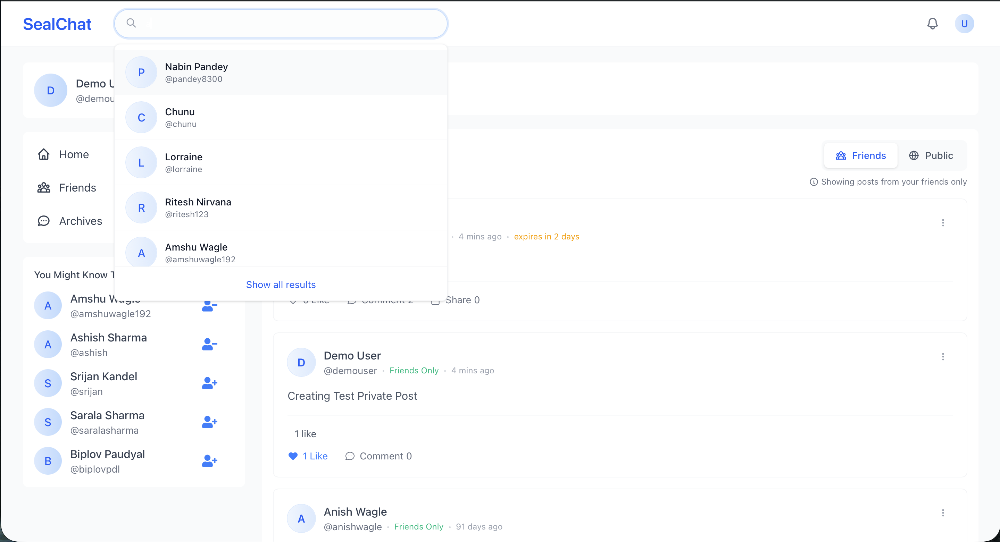
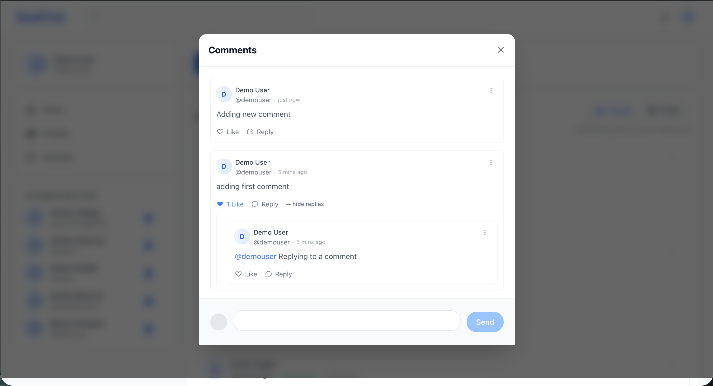

# SealChat 🦭

A privacy-first social media platform built for communities that value control over their content and connections.

> Built during Nepal's social media restrictions in September 2024 as a locally-hosted alternative — designed around two core principles: **selective sharing** and **ephemeral public discourse**.

<!-- Screenshots — add after uploading to /screenshots folder -->











## Live Demo

🌐 [sealchat.vercel.app](https://sealchat.vercel.app)

> All features require a free account. You can register at [sealchat.vercel.app/signup](https://sealchat.vercel.app/signup) or use the demo credentials below.

**Demo Account**
```
Username: DemoUser
Password: Gefvem-wopqyb-7sydmo
```

---

## The Problem It Solves

Most social media platforms force a single visibility model — either everything is public, or you manually manage privacy per post. SealChat takes a different approach: two completely separate systems with distinct rules, giving users genuine control over who sees what.

---

## Core Features

### 🔒 Private Friend Feed
- Mutual connection system — both users must accept before content is shared
- Posts are only visible to accepted friends, never to the public
- Built for close-circle sharing without the noise of public social media

### 🌍 Public Opinion Feed
- Follow-based system — anyone can follow a public profile
- Public posts are **temporary by design**: automatically archived after a user-selected time period
- Permanently and irreversibly deleted after **30 days**
- Encourages honest, timely public discourse without the permanence that causes self-censorship

### 👤 User System
- Secure authentication and user profiles
- Notification system for friend requests, follows, and interactions
- Clean separation between public identity and private social circle

---

## Tech Stack

| Layer | Technology |
|-------|-----------|
| Frontend | Next.js (App Router) |
| Backend | Next.js API Routes |
| Database | MySQL (heavily optimized SQL queries) |
| Auth | JWT / Session-based authentication |
| Hosting | Vercel |

---

## Architecture Highlights

- **Dual feed architecture** — private and public content pipelines are fully separated at the data layer, ensuring no accidental cross-visibility
- **SQL-first backend** — business logic handled through optimized SQL queries rather than ORM abstraction, prioritizing performance for feed generation
- **Ephemeral post lifecycle** — automated archival and deletion pipeline with configurable TTL per post

---

## Running Locally

```bash
# Clone the repo
git clone https://github.com/anishwagle/sealchat.git
cd sealchat

# Install dependencies
npm install

# Set up environment variables
cp sample.env .env.local
# Update MYSQL_HOST, MYSQL_USER, MYSQL_PASSWORD and JWT secrets

# Run the development server
npm run dev
```

Open [http://localhost:3000](http://localhost:3000) in your browser.

---

## Environment Variables

Rename `sample.env` to `.env.local` and fill in your values:

```env
MYSQL_HOST=your_mysql_host
MYSQL_PORT=3306
MYSQL_USER=your_mysql_username
MYSQL_PASSWORD=your_mysql_password
MYSQL_DATABASE=seal_chat
JWT_SECRET=your_jwt_secret
REFRESH_TOKEN_SECRET=your_refresh_token_secret
USE_MOCK=false
```

## Author

**Anish Wagle**
- 🌐 [astroengine.ai](https://www.astroengine.ai)
- 💼 [linkedin.com/in/anishwagle1](https://www.linkedin.com/in/anishwagle1)
- 🐙 [github.com/anishwagle](https://github.com/anishwagle)

---

## License

MIT